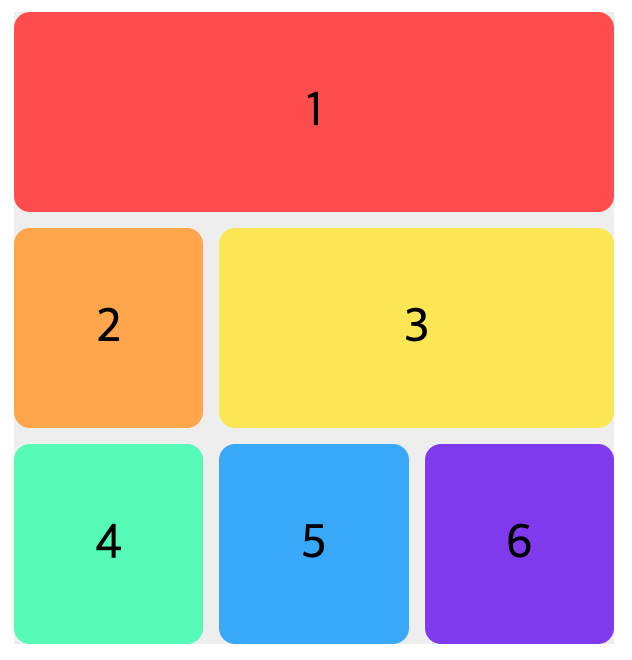
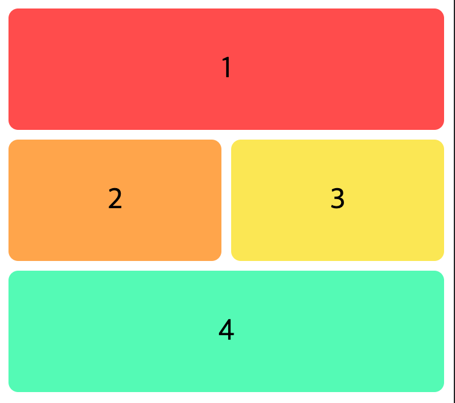
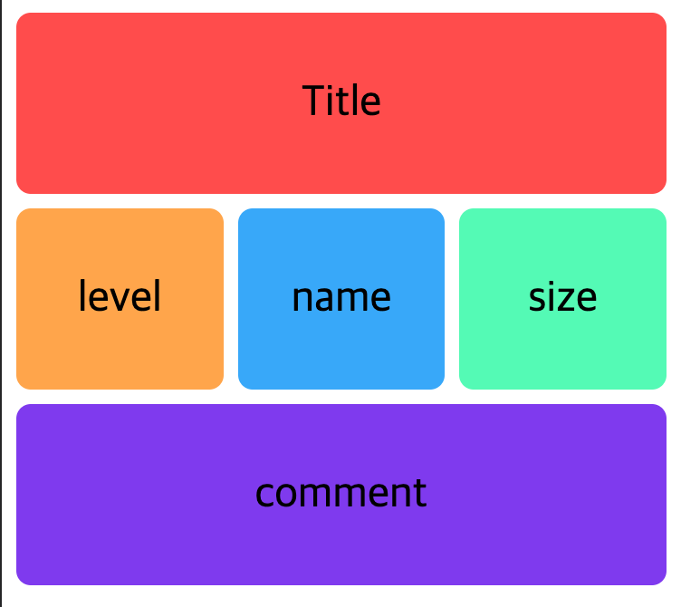
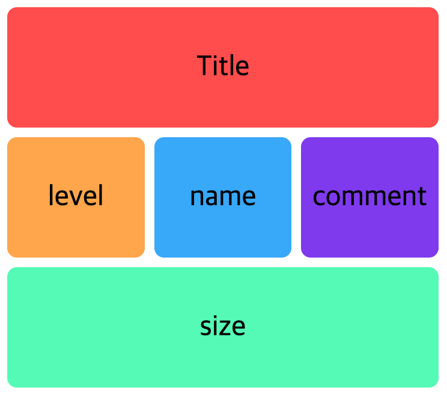
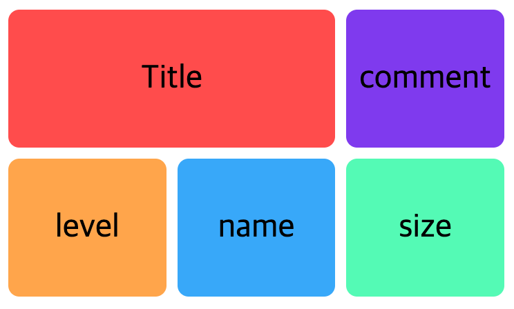
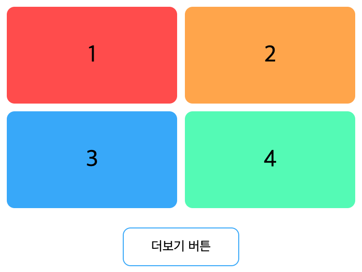
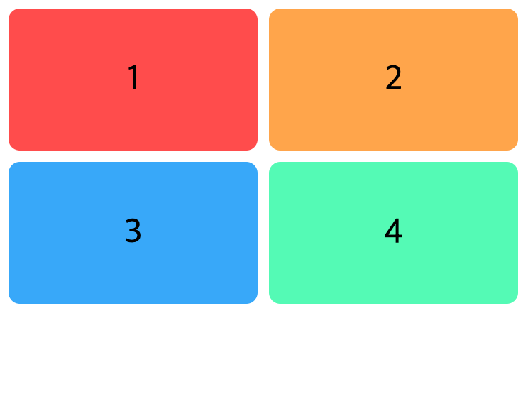
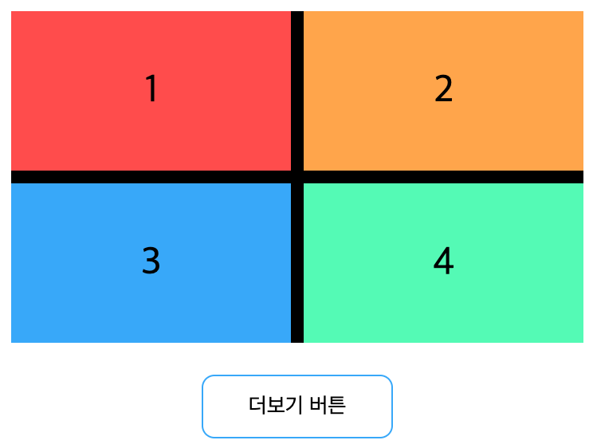

# CSS Grid
*CSS Grid(그리드)는 2차원(행과 열)의 레이아웃 시스템을 제공합니다.*   
## grid란?
*그리드는 수평선과 수직선으로 이루어진 집합체로, 디자인 요소를 정렬할 수 있는 대상 패턴을 생성한다. 이 디자인은 페이지에서 페이지로 이동할 때 요소가 널뛰거나 너비가 바뀌지 않는 디자인 생성에 도움을 주어 웹 사이트의 일관성을 높여준다.*   

*하나의 그리드은 대게 **columns**, **rows**로 구성되며, 각 행과 열 사이에 공백이 있는데, 대게는 이를 일컬어 **gutters**라고 부른다.*   

   

~~*위 레아아웃을 구현하려면 grid로 어떻게 해야할까?*~~

## Grid container 속성
| 속성                        | 의미                                            |
| --------------------------- | ----------------------------------------------- |
| display                     | 그리드 컨테이너(Container)를 정의               |
| grid-template-rows          | 명시적 행(Track)의 크기를 정의                  |
| grid-template-columns       | 명시적 열(Track)의 크기를 정의                  |
| grid-template-areas         | 영역(Area) 이름을 참조해 템플릿 생성            |
| grid-template               | grid-template-xxx의 단축 속성                   |
| row-gap(grid-row-gap)       | 행과 행 사이의 간격(Line)을 정의                |
| column-gap(grid-column-gap) | 열과 열 사이의 간격(Line)을 정의                |
| gap(grid-gap)               | xxx-gap의 단축 속성                             |
| grid-auto-rows              | 암시적인 행(Track)의 크기를 정의                |
| grid-auto-columns           | 암시적인 열(Track)의 크기를 정의                |
| grid-auto-flow              | 자동 배치 알고리즘 방식을 정의                  |
| grid                        | grid-template-xxx과 grid-auto-xxx의 단축 속성   |
| align-content               | 그리드 콘텐츠(Grid Contents)를 수직(열 축) 정렬 |
| justify-content             | 그리드 콘텐츠를 수평(행 축) 정렬                |
| place-content               | align-content와 justify-content의 단축 속성     |
| align-items                 | 그리드 아이템(Items)들을 수직(열 축) 정렬       |
| justify-items               | 그리드 아이템들을 수평(행 축) 정렬              |
| place-items                 | align-items와 justify-items의 단축 속성         |

## Grid Item 속성
| 속성              | 의미                                                             |
| ----------------- | ---------------------------------------------------------------- |
| grid-row-start    | 그리드 아이템(Item)의 행 시작 위치 지정                          |
| grid-row-end      | 그리드 아이템의 행 끝 위치 지정                                  |
| grid-row          | grid-row-xxx의 단축 속성(행 시작/끝 위치)                        |
| grid-column-start | 그리드 아이템의 열 시작 위치 지정                                |
| grid-column-end   | 그리드 아이템의 열 끝 위치 지정                                  |
| grid-column       | grid-column-xxx의 단축 속성(열 시작/끝 위치)                     |
| grid-area         | 영역(Area) 이름을 설정하거나, grid-row와 grid-column의 단축 속성 |
| align-self        | 단일 그리드 아이템을 수직(열 축) 정렬                            |
| justify-self      | 단일 그리드 아이템을 수평(행 축) 정렬                            |
| place-self        | align-self와 justify-self의 단축 속성                            |
| order             | 그리드 아이템의 배치 순서를 지정                                 |
| z-index           | 그리드 아이템의 쌓이는 순서를 지정                               |

----   
   
   

## Grid 장점? (Flex vs Grid)
### 1. 레이아웃 구성에 직관적이고 간편하다.   

   

위 레이아웃을 구성하려면 어떻게 해야할까? (레이아웃 css만 표기함)   

### Dom구조
```html
<div class="grid-container2">
   <div class="grid-container2__item grid-container2__item--block1">1</div>
   <div class="grid-container2__item grid-container2__item--block2">2</div>
   <div class="grid-container2__item grid-container2__item--block3">3</div>
   <div class="grid-container2__item grid-container2__item--block4">4</div>
</div>
```

### Flex
```css
.grid-container2 {
  display: flex;
  flex-wrap: wrap;
  justify-content: space-between;

  &__item {
    height: 150px;

    &--block1 {
      flex: 0 0 100%;
    }

    &--block2,
    &--block3 {
      flex: 0 0 calc(50% - 4px);
      margin-top: 8px;
    }

    &--block4 {
      flex: 0 0 100%;
      margin-top: 8px;
    }
  }
}
```

### Grid
```css
.grid-container2 {
  display: grid;
  grid-template-areas:
    "block1 block1"
    "block2 block3"
    "block4 block4";
  grid-template-columns: repeat(2, 1fr);
  grid-template-rows: repeat(3, 100px);
  gap: 8px;

  &__item {
    &--block1{
       grid-area: block1;
    }
    &--block2{
       grid-area: block2;
    }
    &--block3{
       grid-area: block3;
    }
    &--block4{
       grid-area: block4;
    }
  }
}
```
**flex**는 부모요소 `grid-container2` 레이아웃의 간격을 위해 `justify-content`만 사용되었고   
이외에는 간격, 사이즈를 자식요소에서 선언을 한다.  
   

반면에 **grid**는 부모요소 `grid-container2`에서 레이아웃을 온전히 소화를 한다.   
자식요소는 지정한 형태의 이름만 지정해주면 된다.
- 레이아웃 형태 (`grid-template-areas`)
- 레이아웃의 간격 (`gap`)
- 레이아웃 column의 개수와 크기 (`grid-template-columns`)
- 레이아웃 row의 개수와 크기 (`grid-template-rows`)
---

### 1-1. 직관적이고 유연하다 `grid-template-areas`   
**grid**는 `grid-template-areas` 속성이 있기 때문에 직관적이다.   
아래의 레이아웃은 어떻게 구성해야할까?



### Dom
```html
<div class="grid-container4">
   <div class="grid-container4__item grid-container4__item--title">Title</div>
   <div class="grid-container4__item grid-container4__item--level">level</div>
   <div class="grid-container4__item grid-container4__item--name">name</div>
   <div class="grid-container4__item grid-container4__item--size">size</div>
   <div class="grid-container4__item grid-container4__item--comment">comment</div>
</div>
```
### Grid
```css
.grid-container4 {
   display: grid;
   grid-template-areas:
      "title title title"
      "level name size"
      "comment comment comment";
}
```

부모요소에 `grid-template-area` 선언 후 해당 요소에 `grid-area: title` 선언 하면된다.   
부모요소에서 코드로 레이아웃 구조를 파악하는 것이 가능하다.   
    
또한 DOM구조와 무관하게 레이아웃을 구성 할 수 있다. 예를 들어보자
1. 해당 페이지에선 size정보가 중요해서 아래에 크게 나오면 좋겠어요.
2. 테블릿에선 comment가 title옆으로 갔으면 좋겠어요. (반응형)
   
위 두 문제를 어떻게 해야할까?   
- position을 사용할까? -> 레이아웃의 불안정함
- component를 분리하여 사용할까? -> 관리가 힘들어 비효율적
- 하위 속성인 order 사용하자 -> 사용가능하지만 직관적이지 않다.
   
### `grid-template-area`으로 해결해보자   

#### 1. 해당 페이지에선 size정보가 중요해서 아래에 크게 나오면 좋겠어요.


### Grid
```css
.grid-container4 {
   display: grid;
   grid-template-areas:
    "title title title"
    "level name comment"
    "size size size";
}
```

#### 2. 테블릿에선 comment가 title옆으로 갔으면 좋겠어요. (반응형)


### Grid
```css
.grid-container4 {
   display: grid;
   grid-template-areas:
    "title title title"
    "level name comment"
    "size size size";

    @media(min-width: 576px) and (min-height:1024px){
      grid-template-areas:
      "title title comment"
      "level name size";
    }
}
```

---
### 2. 간격 값 설정이 정말 쉽다   


   

component에서 버튼이 있는/없는 케이스는 마진을 어떻게 해야할까?   
간격은 8px!
### Dom구조
```html
<div class="grid-container3">
   <div class="grid-container3__item grid-container3__item--block1">1</div>
   <div class="grid-container3__item grid-container3__item--block2">2</div>
   <div class="grid-container3__item grid-container3__item--block3">3</div>
   <div class="grid-container3__item grid-container3__item--block4">4</div>
</div>
<button>더보기 버튼</button>
```

### Flex
```css
.grid-container3 {
  display: flex;
  flex-wrap: wrap;
  justify-content: space-between;

  &__item {
    flex: 0 0 calc(50% - 4px);
    height: 100px;
    margin-bottom: 8px;

    &:nth-last-child(-n + 2) {
      margin-bottom: 0;
    }
  }
}
```

### Grid
```css
.grid-container3 {
  display: grid;
  grid-template-columns: repeat(2, 1fr);
  grid-auto-rows: 100px;
  gap: 8px;
}
```

   

**grid**에는 간격을 위한 gap속성이 있다.   
위 이미지의 검은색 부분이 gap이 적용된 부분이다.   
요소들 사이에만 적용이 된다.   
반면에 **flex**사용하면 요소에 margin을 주고   
마지막 요소 두개에 margin을 없애기 위하여 `nth-last-child(-n + 2)`를 추가 해야한다.

---

### 3. 1fr 단위
위에서 grid의 장점은 gap이라고 하였는데   
flex에도 gap을 사용 할 수 있다.   
하지만 1fr 없는 gap 앙코없는 찐빵이다.

#### 1fr란?   
*fr이란 유연한 크기를 갖는 단위입니다.*   
*그리드 컨테이너 내의 공간 비율을 분수(fraction)로 나타냅니다.*   
*사용자가 계산해야 할 부분을 fr을 통해서 쉽고 유연하게 사용할 수 있습니다.*
   

   

### Flex
```css
.grid-container3 {
  display: flex;
  gap: 8px;
  flex-wrap: wrap;
  justify-content: space-between;

  &__item {
    flex: 0 0 calc(50% - 4px);
    height: 100px;
  }
}
```

### Grid
```css
.grid-container3 {
  display: grid;
  grid-template-columns: repeat(2, 1fr);
  grid-auto-rows: 100px;
  gap: 8px;
}
```

*flex*로 gap을 사용하려면 내가 계산을 하여 css를 기입해야한다.   
`flex: 0 0 calc(50% - 4px)`   
반면 *grid*는 1fr와 gap만 사용하면 된다.   

1fr는 clac를 사용하지않고 유연한 레이아웃을 만들어준다.

---

## Grid의 단점
grid의 단점은 browser 호환성이 제일 컸었다.   
하지만 이제 explorer가 종료됨에 따라 사용해도 무방할듯하다. (그럼 단점이 없을지도...?)


## 결론
grid의 장점을 위주로 기재하여 flex는 안 좋게(?) 설명된 거 같은데 절대 그렇지 않다.   
gap은 동일한 간격에서만 사용 가능하다. 간격이 다를 경우에는 사용하지 못한다.   
grid는 button, label 등에서 권장하지 않고   
단순 요소를 옆으로 *`제목 + 버튼`* 경우에는 flex를 사용하는 것이 더 깔끔하다.   
흑묘백묘(黑猫白猫)라고 하였다. 검은 고양이든 흰 고양이든 상관없이, 쥐를 잘 잡는 고양이가 좋은 고양이이다.   
필요에 따라 grid, flex를 사용하도록 하자!
